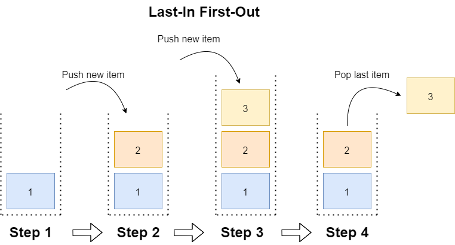

# Stacks
## What is a Stack?
A stack is a data structure that is characterized by the way data is stored and accessed. Stacks use a "Last in, First Out" rule which is just as it sounds. The last piece of data to be entered into the stack will be the first to be removed. Think of a stack of pancakes. As you cook the pancakes you will put them on a plate. The pancakes that are cooked first will be at the bottom of the stack while the pancakes cooked last will be at the top. Stacks in programming are no different. The values added first will be at the front or bottom of the stack and the values added last will be at the back or front of the stack.

## How does a Stack work?
As mentioned above when adding to or removing data from a stack it will use a "Last In, First Out" rule. See the image below for more details. To add to a stack you will use the "Push" operation. This will add a value to the top or back of the set. This is the equivalent of the "Add" operation used for lists. The remove a value you will use the "Pop" operation. The "Pop" operation will remove and return the value found at the back of the stack. Much like taking the pancake at the top of the stack.
  

## The Issue with Stacks
Because stacks use "Last In, First Out" the values found at the bottom of the stack may take a long time to be used. For this reason stacks aren't useful if you need to rotate through the data. For example, if a company buys produce it would not be ideal to use a stack to store this information. The produce that is the freshest will be sold first leaving the older produce to sit and get even older. In this scenario the old produce would likely end up rotting because only the newest produce is being used.

## Applications of Stacks
Stacks do have a place. They are very helpful for features such as the back button, back space, and undo buttons. When you use these features you are telling the computer to go back to the last thing you did or erase the last thing you added. In a stack this information woukld be stored at the back of the stack so it is easy for the computer to "Pop" the last item. This will undo the last item that was added or go back to the last page that was visited. Stacks are very useful when we are trying to remember where we have been.

## Stacks in C# and Efficiency of Common Set Operations
| Common Stack Operation | Description                                                           | C# Code                    | Performance/ Big O Notation              |
|------------------------|-----------------------------------------------------------------------|----------------------------|------------------------------------------|
| push(value)            | Adds "value" to the back of the stack.                                | mySet.Push(value)          | O(1)|
| pop()                  | Removes and returns the value the is at the back or top of the stack. | var Value = mySet.pop()    | O(1)|
| empty()                | Returns "True" if the stack is empty or has a length of zero.         | if (myStack.Count == 0)    | O(1)|
| size()                 | Return the size or number of items in the stack.                      | var length = myStack.Count | O(1)|

## Example Problem
You are writing a sentence with twelve words in it. You add the twelve words using the "Push" operation. You decide you don't like how you worded the last to words so you remove them using the "Pop" operation. You will then add two new words to replace the removed ones.
[Example Problem](ds1-example)

## Student Problem
Please attempt the problem on your own before looking at the solution.

[Student Problem](ds1-problem)

## Solution for Student Problem
[Student Solution](ds1-solution)

## Important Terms
### Stack
A stack is a data structure that follows a "Last In, First Out" rule. Stacks are used to remember previous data or value or to reverse data.
### Front
The front of a stack refers to the location of the first item or value added to a stack. Image the bottom of a stack of pancakes.
### Back
The back of a stack refers to the location of the last item or value added to a stack. Imagine the top of a stack of pancakes.
### Push
The "Push" operation will add a new value to the back of a stack.
### Pop
The "Pop" operation will remove and return the value found at the back of a stack.