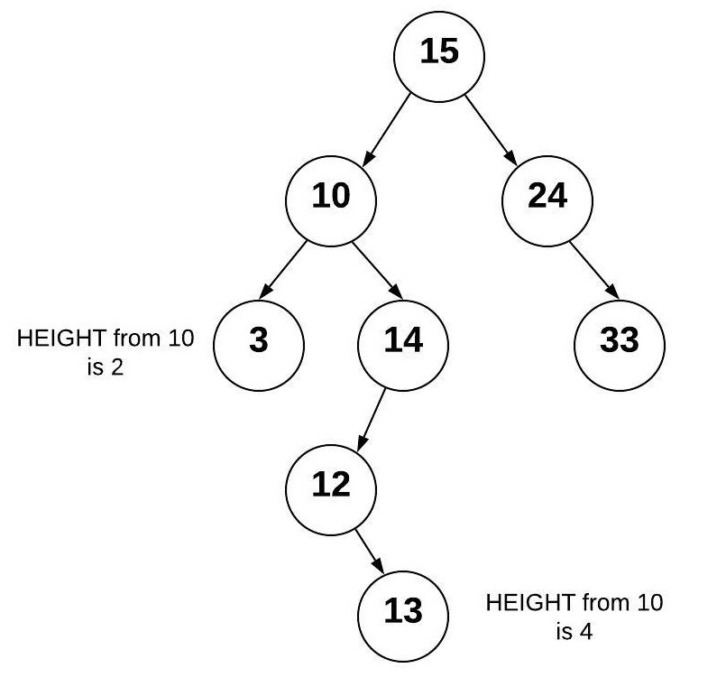

# Trees
## What is a Tree?
A tree is a data structure that uses nodes to store data. Every tree will have a root node and other nodes that branch off the root node. These nodes are connected together by pointers. There are three tpyes of Trees that we will look as: Binary Trees, Binary Search Trees, and Balanced Binary Search Trees.

## Binary Trees
A binary tree is a tree that will connect to no more than two other nodes. In other words the root node will only have two children nodes. The root node is the first node on a tree or the top node. A parent node is a node that has connected nodes. The node connected to the parent node is called a child. Nodes that do not have children nodes are called leaves. The left and right branches of the tree are each subtrees. Please see the image below for more details.
  

  
Image found at https://byui-cse.github.io/cse212-csharp/lesson09/prepare

## Binary Search Trees
A Binary Search Tree is Tree that has  special set of rules for how the data is stored within the tree. All no data that is entered into the tree is first compared to the root node and then to the parent node. Values that are greater than the root node are stored in the right subtree and values that are less than the root are stored in the left subtree. The same rules are then applies to the parent node. Greater values will be set to the right and less values will be set to the left. See the image below for more details. The process used to find the next available node has a performance of O(log n).
  

  
Image found at https://www.javatpoint.com/binary-search-tree

## Balanced Binary Search Trees
A Balanced Binary Search Tree is a Binary Search Tree that is balanced. This means that the height of one subtree will not be dramatically different than the other. There are algorthms that have been written to ensure that a Balanced Binary Search Tree will remain balanced will new data is entered and if it is unbalanced these algorithms with rebalance the tree. Two of the algorithms are Red Black Trees and AVL Trees.
### Red BLack Tree
A Red Black Tree is a true that uses an algorithm to balance itself. Each node in a Red Black tree is also assigned a color. Each node will be either red or black. The root node will always be black. Red nodes will not have red children nodes. Every path from a node to its descendant leaf nodes has the same number of black nodes.All leaf nodes are black.
Using these color rules it ensures that the tree will stay balanced.
### AVL Tree
If a value is added to a balanced binary search tree that makes the tree unbalanced the algorithm will rotate the node. It will turn the new node into a leaf node and keep the older nodes as leaf nodes as well. Otherwise one of the leaf nodes would become a parent making the tree unbalanced. See the images below for more details.
  

  
**-----------------------------------------------------------------------Unbalanced------------------------------------------------------------------**
  

  
**-----------------------------------------------------------------------Rebalanced------------------------------------------------------------------**
  
Images found at https://byui-cse.github.io/cse212-csharp/lesson09/prepare

## Trees in C# and Efficiency of Common Set Operations
| Common Tree Operation | Description                                                                                                       | Performance/ Big O Notation                                                                                                                  |
|-----------------------|-------------------------------------------------------------------------------------------------------------------|----------------------------------------------------------------------------------------------------------------------------------------------|
| insert (value)        | Insert a value into the tree.                                                                                     | O(log n) - Uses recursion to find the next available node to store data in.                                                                  |
| remove(value)         | Remove a value from a tree.                                                                                       | O(log n) - Uses recursion to search the tree for a value then removes that value.                                                            |
| contains(value)       | Determines if a value exists within the tree.                                                                     | O(log n) - Uses recursion to search the tree for a value.                                                                                    |
| traverse_forward      | Visits all objects in the tree from smallest to largest.                                                          | O(n) - Uses recursion to traverse the left subtree then the right subtree.                                                                   |
| traverse_reverse      | Visits all objects in the tree from largest to smallest                                                           | O(n) - Uses recursion to traverse the right subtree then the left subtree.                                                                   |
| height(node)          | Determines the height of the tree. If the overall height of the tree is needed, the root node should be provided. | O(n) - Uses recursion to find the height of the left and the right subtrees. The maximum height is returned. Add one more for the root node. |
| size()                | Returns the size of the tree.                                                                                     | O(1) - The size is maintained within the BST class.                                                                                          |
| empty()               | Returns true if the root node is empty.                                                                           | O(1) - Comparing the root node or the size.                                                                                                  |

## Example Problem
Please see Example problem to learn how to Insert into and Traverse through a tree.

This problem is simply creating a Binary Search Tree, Adding Values, then traversing through the tree and printing the values.
[Example Problem](ds3-example)

## Student Problem
Please attempt the problem on your own before looking at the solution.

You like to go fishing and you want to track the quantities of fish you catch. Create a new Binary Search Tree, insert you quantities of fish into the tree, then traverse through the tree and print the results to the screen.
Use the example as a guideline to complete this problem.

[Student Problem](ds3-problem)

## Solution for Student Problem
[Student Solution](ds3-solution)

## Important Terms
### Tree
A tree is a data structure that starts with a root node and branches off according to relation between the nodes. There are no disconnected nodes or any loops.
### Binary Tree
A tree that has two children per node.
### Binary Search Tree
A tree that sorts data by putting data that is less than the root to the left and data the is more than the root to the right. Binary Search Trees increase efficiency in searching algorithms
### Balanced Binary Search Tree
A binary search tree that is restructured to be balanced. When searching a balanced binary search tree you get a performance of O(log n).
### Node
A value that is entered into a tree. It contains the value and the pointers to any children nodes.
### Root
The first node in a tree.
### Parent
A node that connects to children nodes.
### Child
A node that connects from a parent node.
### Leaf
A node that has no children nodes.
### Traverse
The process of visiting each node in a tree and the values stored in the nodes. Used often using recursion to navigate from the leaf node with the smallest value to the leaf node that contains the largest value.
### Recursion
The process a procedure goes through when one of the steps of the procedure is calling the procedure itself.
### Subtree
A subtree is a subset of a tree made when a new node is selected to be the root node and all of the children nodes are included.
### Balanced
A tree is balanced when the height of a tree is the same from the root node to each of the leaf nodes.
### Red Black Tree
A binary search tree that is self-balancing

